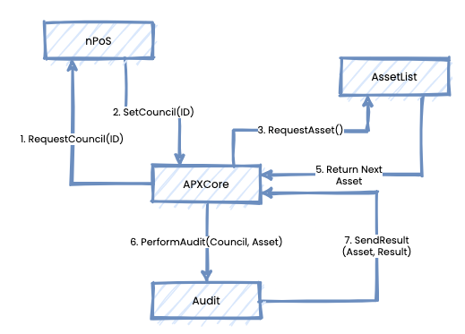

# APX Core Protocol

The goal of the APX Core Protocol Prototype is to

* Have an Auditor Pool made up of Auditors staking AAPX tokens
* Have a selection system for creating Auditing Councils from the Auditor Pool
* Have a "holder" contract holding IPFS hashes of Auditing Procedures

It is mapped out like this:

